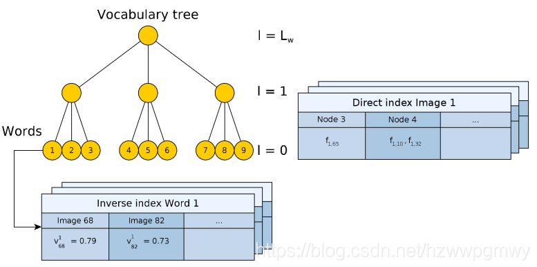
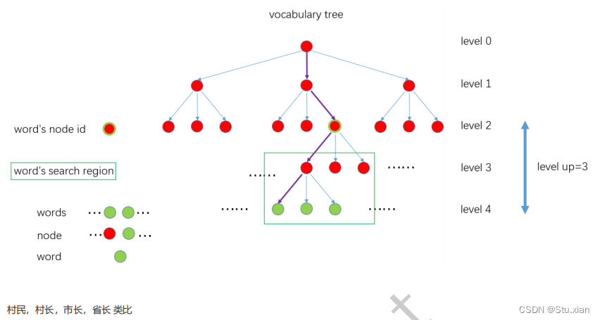

## 1 BoW
ORB_SLAM 使用 BoW 进行相似图像检索，在重定位、回环检测、参考关键帧跟踪过程中都有用到。BoW 是一种 K 叉树形式的分类树，在构造 K 叉树时，根据特征描述的相似性作为距离度量进行聚类，树的叶子节点被计为单词，每个单词使用特征点的聚类中心表示。在进行特征匹配时，根据特征点是否落在同一个叶子节点判断是否对应同一个单词，同时可以得到一个相似度得分。一般在进行图像特征匹配时会根据公共单词数量和最小的相似度得分判断图像之间的相似性。

### 1.1 TF-IDF
TF（Term Frequency），指在单帧中某个单词的频次，频次高，权重大
IDF（Inverse Document Frequency），某个单词在词典中出现的频次，频次越低，则辨识度越高，相应权重 IDF 越大
最终 BoW 的权重是 `TF*IDF` ，每个单词都有自己的权重。

### 1.2 正向索引
再计算BoW时，每帧图像会记录一个正向索引表，记录在kd树某一层，命中的节点集合，以及节点中的特征点，用于加速两帧图像之间的特征点匹配。
### 1.3 逆向索引
orb-slam 中维护了一个关键帧数据库，其中有一个单词的逆向索引表，其记录了包含这个单词的关键帧和权重，用于快速查找匹配关键帧。

### 1.4 相似性对量
1. L1  ，各维度的差值的绝对值求和
2. 余弦相似度 ，向量夹角

### 1.5 levelsup
ORB_SLAM 在对图像生成词向量时，会根据 levelsup 记录图像中的单词落在了某层的哪些分支，这样在进行单词匹配时，只需要查找对应分支而不是从根节点开始查找，提高查找效率。



Reference:
[基于词袋模型的图像匹配 - Line's Blog](https://xhy3054.github.io/2019/04/19/2019-04-19-bow/)

Appendix:
```cpp
/*
 * @brief 通过词袋，对关键帧的特征点进行跟踪，该函数用于闭环检测时两个关键帧间的特征点匹配
 * @details 通过bow对pKF和F中的特征点进行快速匹配（不属于同一node的特征点直接跳过匹配） 
 * 对属于同一node的特征点通过描述子距离进行匹配 
 * 通过距离阈值、比例阈值和角度投票进行剔除误匹配
 * @param  pKF1               KeyFrame1
 * @param  pKF2               KeyFrame2
 * @param  vpMatches12        pKF2中与pKF1匹配的MapPoint，vpMatches12[i]表示匹配的地图点，null表示没有匹配，i表示匹配的pKF1 特征点索引
 * @return                    成功匹配的数量
 */
int ORBmatcher::SearchByBoW(KeyFrame *pKF1, KeyFrame *pKF2, vector<MapPoint *> &vpMatches12)
{
    // Step 1 分别取出两个关键帧的特征点、BoW 向量、地图点、描述子
    const vector<cv::KeyPoint> &vKeysUn1 = pKF1->mvKeysUn;
    const DBoW2::FeatureVector &vFeatVec1 = pKF1->mFeatVec;
    const vector<MapPoint*> vpMapPoints1 = pKF1->GetMapPointMatches();
    const cv::Mat &Descriptors1 = pKF1->mDescriptors;

    const vector<cv::KeyPoint> &vKeysUn2 = pKF2->mvKeysUn;
    const DBoW2::FeatureVector &vFeatVec2 = pKF2->mFeatVec;
    const vector<MapPoint*> vpMapPoints2 = pKF2->GetMapPointMatches();
    const cv::Mat &Descriptors2 = pKF2->mDescriptors;

    // 保存匹配结果
    vpMatches12 = vector<MapPoint*>(vpMapPoints1.size(),static_cast<MapPoint*>(NULL));
    vector<bool> vbMatched2(vpMapPoints2.size(),false);

    // Step 2 构建旋转直方图，HISTO_LENGTH = 30
    vector<int> rotHist[HISTO_LENGTH];
    for(int i=0;i<HISTO_LENGTH;i++)
        rotHist[i].reserve(500);

    //! 原作者代码是 const float factor = 1.0f/HISTO_LENGTH; 是错误的，更改为下面代码   
    const float factor = HISTO_LENGTH/360.0f;

    int nmatches = 0;

    DBoW2::FeatureVector::const_iterator f1it = vFeatVec1.begin();
    DBoW2::FeatureVector::const_iterator f2it = vFeatVec2.begin();
    DBoW2::FeatureVector::const_iterator f1end = vFeatVec1.end();
    DBoW2::FeatureVector::const_iterator f2end = vFeatVec2.end();

    while(f1it != f1end && f2it != f2end)
    {
        // Step 3 开始遍历，分别取出属于同一node的特征点(只有属于同一node，才有可能是匹配点)
        if(f1it->first == f2it->first)
        {
            // 遍历KF中属于该node的特征点
            for(size_t i1=0, iend1=f1it->second.size(); i1<iend1; i1++)
            {
                const size_t idx1 = f1it->second[i1];

                MapPoint* pMP1 = vpMapPoints1[idx1];
                if(!pMP1)
                    continue;
                if(pMP1->isBad())
                    continue;

                const cv::Mat &d1 = Descriptors1.row(idx1);

                int bestDist1=256;
                int bestIdx2 =-1 ;
                int bestDist2=256;

                // Step 4 遍历KF2中属于该node的特征点，找到了最优及次优匹配点
                for(size_t i2=0, iend2=f2it->second.size(); i2<iend2; i2++)
                {
                    const size_t idx2 = f2it->second[i2];

                    MapPoint* pMP2 = vpMapPoints2[idx2];

                    // 如果已经有匹配的点，或者遍历到的特征点对应的地图点无效
                    if(vbMatched2[idx2] || !pMP2)
                        continue;

                    if(pMP2->isBad())
                        continue;

                    const cv::Mat &d2 = Descriptors2.row(idx2);

                    int dist = DescriptorDistance(d1,d2);

                    if(dist<bestDist1)
                    {
                        bestDist2=bestDist1;
                        bestDist1=dist;
                        bestIdx2=idx2;
                    }
                    else if(dist<bestDist2)
                    {
                        bestDist2=dist;
                    }
                }

                // Step 5 对匹配结果进行检查，满足阈值、最优/次优比例，记录旋转直方图信息
                if(bestDist1<TH_LOW)
                {
                    if(static_cast<float>(bestDist1)<mfNNratio*static_cast<float>(bestDist2))
                    {
                        vpMatches12[idx1]=vpMapPoints2[bestIdx2];
                        vbMatched2[bestIdx2]=true;

                        if(mbCheckOrientation)
                        {
                            float rot = vKeysUn1[idx1].angle-vKeysUn2[bestIdx2].angle;
                            if(rot<0.0)
                                rot+=360.0f;
                            int bin = round(rot*factor);
                            if(bin==HISTO_LENGTH)
                                bin=0;
                            assert(bin>=0 && bin<HISTO_LENGTH);
                            rotHist[bin].push_back(idx1);
                        }
                        nmatches++;
                    }
                }
            }

            f1it++;
            f2it++;
        }
        else if(f1it->first < f2it->first)
        {
            f1it = vFeatVec1.lower_bound(f2it->first);
        }
        else
        {
            f2it = vFeatVec2.lower_bound(f1it->first);
        }
    }

    // Step 6 检查旋转直方图分布，剔除差异较大的匹配
    if(mbCheckOrientation)
    {
        int ind1=-1;
        int ind2=-1;
        int ind3=-1;

        ComputeThreeMaxima(rotHist,HISTO_LENGTH,ind1,ind2,ind3);

        for(int i=0; i<HISTO_LENGTH; i++)
        {
            if(i==ind1 || i==ind2 || i==ind3)
                continue;
            for(size_t j=0, jend=rotHist[i].size(); j<jend; j++)
            {
                vpMatches12[rotHist[i][j]]=static_cast<MapPoint*>(NULL);
                nmatches--;
            }
        }
    }

    return nmatches;
}


```