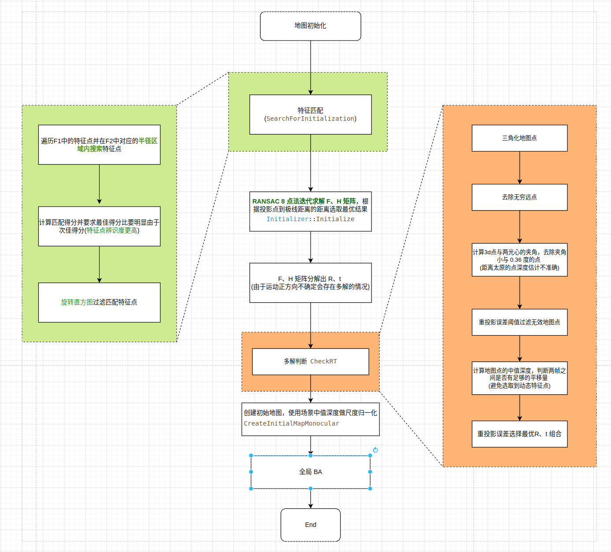
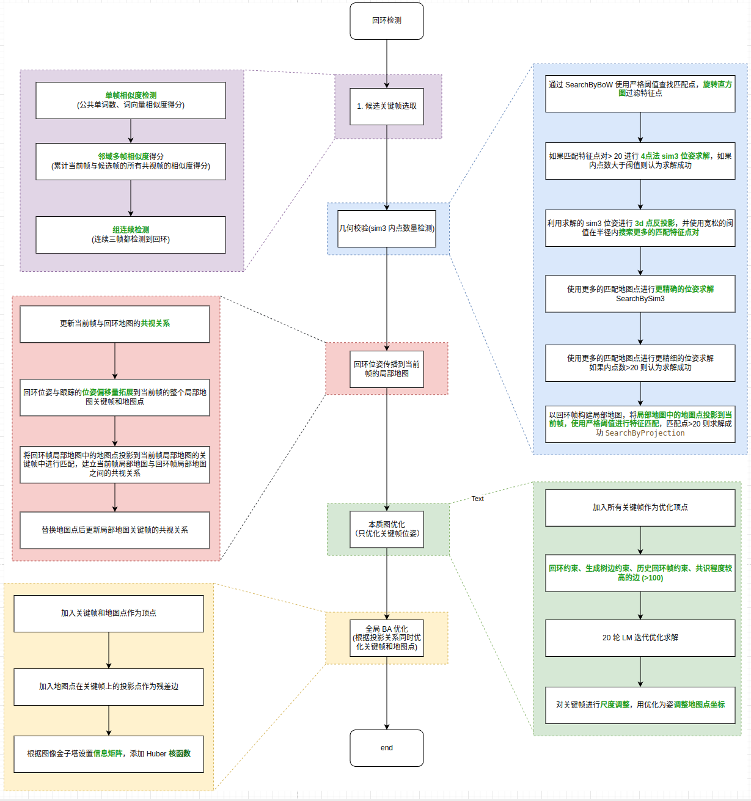
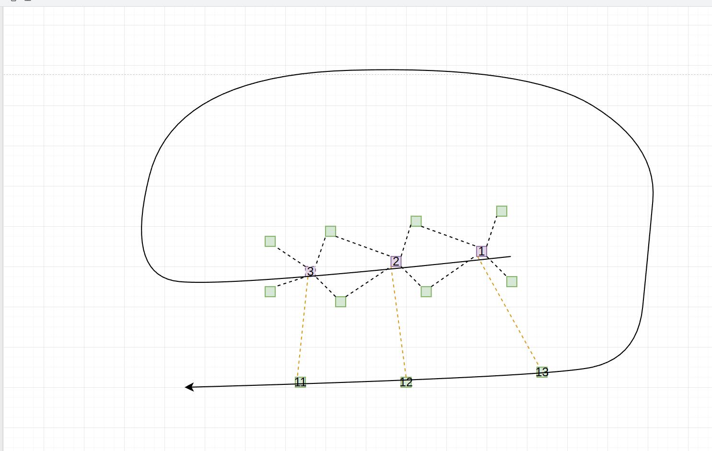
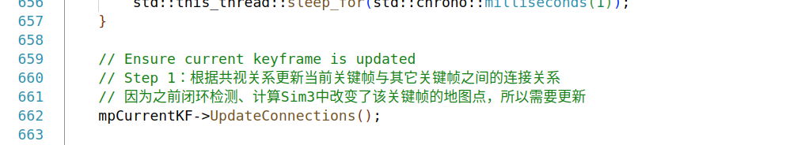
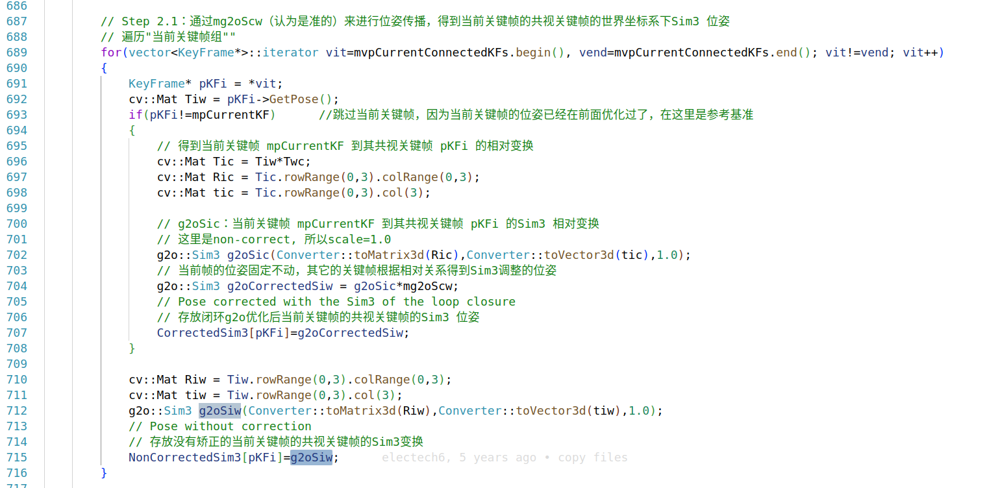

## 1 单目初始化

ORB_SLAM 的地图初始化主要分为 5 个过程。
第一步时根据特征点匹配选择匹配数量足够多的两帧图像作为初始图像，
第二步根据匹配特征点进行多轮 ransac 迭代，通过 8 点法求解基础矩阵和单应矩阵，
第三步利用初始位姿三角化地图点，并过滤一些不好的地图点主要包括 (距离太远的点，因为距离太远的点深度估计不准确， 重投影误差太大的点等等)。
第四步进行R，t的选取，做这一步的原因是由于单目初始化求的是一个相对位姿关系，没有一个固定的坐标系，所以其旋转、平移的正方向不确定，因此求解结果会存在多种运动组合。对于基础矩阵会有四种解，但是对于 H 矩阵会存在 8中解，因为单应矩阵是利用平面法向量做映射，它引入了平法向量的正负不确定性。除此之外基础矩阵还需要做平移量大小的判断，因为如果两帧之间的平移量太小，会导致深度计算的不准确，像素的误差会被无限放大到深度上，而且像素坐标是有分辨率极限的不是连续的，所以深度误差必定存在。
第五步构建地图点与之间的链接关系，并使用场景中值深度进行尺度归一化
第六步进行全局 BA 优化，优化完之后根据地图中地图点的深度中值做尺度归一化


>Tips1  由于单初始化确定的相对位姿，没有一个确定的坐标系，所以两帧之间运动的正方向是不确定的，对于 F 矩阵由于R和t的方向运动方向不确定，所以其有4组合的解，但是对于 H 矩阵，因为基于平面投影转换，由于平面法向量的正负不确定，导致 H 矩阵的深度方向也是不确定的，所以其会有 8 种可能的解。ORB_SLAM 会根据重投影的内点数量选择最合适的组合。

>Tips2  F 矩阵需要考虑纯旋转问题，因为纯旋转时无法准确的求出t，ORB_SLAM 使用所有3d点视差的中值来判断纯旋转，这样可以避免误选到动态特征点。

## 2 回环检测

### 2.1 回环候选帧选取 
ORB_SLAM 的回环候选帧选取主要分为图像相似度检测和组连续检测。
1. 图像相似度检测，当前帧与候选帧之间的公共单词数量和相似度得分要高于局部地图的最低得分。
2. 组连续检测，需要有连续3帧的当前帧都和同一个组的候选帧产生回环匹配。


Step 1 : 相似图像检测
ORB_SLAM2 在进行相似图像检测时有两个判断的标准，一个单帧的相似性，另一个邻域多帧的相似性。单帧的相似性主要是根据图像帧之间的公共单词数量和相似度得分进行判断。邻域多帧相似性是通过累计当前帧与候选帧的共视帧之间所有相似度得分来进行判断，这么是为了保证选取的候选帧与当前帧之间有足够的共视约束，有利于后续以候选帧构建局部地图来求解当前帧的回环位姿。

> ORB_SLAM 中的*单词数量*阈值为最大公共单词数量 * 0.8，BoW 得分阈值为当前帧的共视关键帧中最低的相似度得分，邻域多帧相似性得分是累计得分的最大值 * 0.75 ， 详情建 Appendix  KeyFrameDatabase::DetectLoopCandidates

Step 2 : 组连续检测
组连续检测是为了防止触发误回环，他的原理是在更踪过程中的连续多帧都检测到了回环候选帧，并且这些回环候选这年都是在一个连续相邻的区域。一个有效的组连续检测结果如下图所示：


> 组: 与当前帧具有一级共视关系的关键帧集合为一组
> 组连续: 关键帧之间不是之间的共视关系，但是有共同的共视帧称为组连续，如图中 1和 2。

### 2.2 sim3 位姿求解 ` Sim3Solver::ComputeSim3`
sim3 几何验证主要是为了避免对纹理相似场景的误判，首先根据 BoW 在回环候选帧与当前前帧之间进行查找匹配特征点，如果匹配特征点足够(>20)(`ORBmatcher::SearchByBoW`)，那么进行 sim3 位姿求解。对匹配关键帧对应的 3d 点分别使用旧位姿和 sim3 位姿进行反投影，统计允许误差范围内的内点数量(见 `Sim3Solver::CheckInliers`)，如果内点数达到了阈值则认为求解成功。 使用 sim3 位姿进行反投影查找更多的特征点 `ORBmatcher::SearchBySim3`，其具体操作时使用 sim3 位姿将地图点

>`ORBmatcher::SearchByBoW` 和 `ORBmatcher::SearchBySim3` 在都是用特征描述符之见的距离进行匹配特征点的筛选，但是 `ORBℹimatcher::SearchByBoW` 使用更严格的阈值`ORBmatcher::TH_LOW = 50` 而`ORBmatcher::SearchBySim3` 使的阈值更宽松，`ORBmatcher::TH_HIGH = 100`。前者是为了尽量防止误匹配，后则则是为了增加约束提高求解精度，同时避免光照变化等导致特征点的匹配得分较低，而错过一些可用的特征点对，例如：车辆从相反的方向驶过同一各地方，由于提取的特征点是镜像的，所以可能导致匹配得分偏低。

```cpp
```
### 2.3 当前帧局部地图更新
在求得当前帧的回环位姿后，需要建立当前帧局部和回环帧局部地图之间的共视关系，主要包括：
1. 更新当前帧与回环帧之间的共视关系，因为之前通过 `ORBmatcher::SearchBySim3` 新增了一些当前帧和回环帧之间的匹配点，这一步主要是将匹配特征点与地图点相关联。

2. 将回环位姿与更踪位姿的偏移量拓展到当前帧局部地图中的关键帧和地图点

3. 将回环帧局部地图中的地图点投影当前帧的局部地图中，建立匹配关系，同时更新局部地图之间的连接关系```

4. ![[11-ORB_SLAM.png]]
5. 只获取当前帧与回环地图之间的连接关系，然后进行本质图优化。也就是联合当前帧的局部地图和回环帧的局部地图进行位姿优化
![[10-ORB_SLAM.png]]
6. 将回环帧局部地图中的地图点投影到当前帧局部地图，根据投影点匹配关系，更新局部地图帧间的共视

### 2.4 回环位姿优化
g2o 优化最重要的是确定待优化变量(顶点)和边约束(比较确定的观测值，尽量保证这些值不边)。所以在构建图优化时，我们需要做的只有两件事，确定待优化变量、固定变量、和有哪些可用的观测约束
#### 2.4.1 本质图优化 `Optimizer::OptimizeEssentialGraph`
本质图优化的目标是在检测到闭环后，通过优化一组稀疏的关键帧位姿（Sim3位姿，包含尺度因子）来校正整个地图的累积误差。它不同于全局BA（优化所有关键帧位姿和地图点），而是只优化关键帧位姿，且仅使用共视图中的强连接边（生成树、强共视边、闭环边）来构建图结构。这样可以在保证精度的同时大幅减少计算量，实现实时优化。


顶点(待优化变量): 
	地图中的所有关键帧，优先使用回环优化后的sim3位姿，固定回环帧的位姿
边 (约束，一般为比较可信的相对位姿):   
	1. 回环约束，优先回环位姿作为观测
	2. 生成树边约束，优先使用跟踪位姿作为观测 
	3. 历史回环边约束，优先使用历史位姿作为观测
	4. 共识程度较高的边 (>100)，优先使用历史关键帧作为观测
残差
	 相对位姿残差

> 在构见本质图优化时，没有对关键帧使用边边缘化策略，并且信息矩阵设置为单位矩阵


优化完成之后，对关键帧进行词读调整，调整地图点位姿，具体做法就是使用关键帧的旧位姿将3d点变换到相机坐标后，用优化后的关键帧位姿将相机坐标系下的地图点变换到世界坐标系下。

#### 2.4.2 全局 BA `Optimizer::GlobalBundleAdjustemnt`
顶点:  
	-  所有关键帧，0 号帧位姿被固定
	-  所有地图点
边: 
	-  地图点的重投影像素坐标作为边，但是会根据特征点在图像金子塔上层数进行加权，图层越高，可信度越差。
	-  
残差: 
	-  地图点的重投影误差，特征点作为观测


> 根据特征点在不同的金子塔层数，设置协方差矩阵，低 0 层的协方差为 $I$ , 层数越高协方差矩阵的值越小，这是一种特定点进行加权的方式。
> BA 优化对地图点使用了 schur 消元，加速求解 `vPoint->setMarginalized(true);
> 对于重投影误差，我们使用鲁棒的 Huber 核来减少虚假匹配的影响。由于惯性残差不存在虚假匹配，因此不需要Huber kernel函数，所以本质图优化没有使用核函数


## 3 Appendix 

```cpp
/**
 * @brief 在闭环检测中找到与该关键帧可能闭环的关键帧（注意不和当前帧连接）
 * Step 1：找出和当前帧具有公共单词的所有关键帧，不包括与当前帧连接的关键帧
 * Step 2：只和具有共同单词较多的（最大数目的80%以上）关键帧进行相似度计算 
 * Step 3：计算上述候选帧对应的共视关键帧组的总得分，只取最高组得分75%以上的组
 * Step 4：得到上述组中分数最高的关键帧作为闭环候选关键帧
 * @param[in] pKF               需要闭环检测的关键帧
 * @param[in] minScore          候选闭环关键帧帧和当前关键帧的BoW相似度至少要大于minScore
 * @return vector<KeyFrame*>    闭环候选关键帧
 */
vector<KeyFrame*> KeyFrameDatabase::DetectLoopCandidates(KeyFrame* pKF, float minScore)
{
    // 取出与当前关键帧相连（>15个共视地图点）的所有关键帧，这些相连关键帧都是局部相连，在闭环检测的时候将被剔除
    // 相连关键帧定义见 KeyFrame::UpdateConnections()
    set<KeyFrame*> spConnectedKeyFrames = pKF->GetConnectedKeyFrames();

    // 用于保存可能与当前关键帧形成闭环的候选帧（只要有相同的word，且不属于局部相连（共视）帧）
    list<KeyFrame*> lKFsSharingWords;

	// Step1 根据 BoW 的逆索引查找与当前关键帧有公共单词的帧
    {
        unique_lock<mutex> lock(mMutex);

        // words是检测图像是否匹配的枢纽，遍历该pKF的每一个word
        // mBowVec 内部实际存储的是std::map<WordId, WordValue>
        // WordId 和 WordValue 表示Word在叶子中的id 和权重
        for(DBoW2::BowVector::const_iterator vit=pKF->mBowVec.begin(), vend=pKF->mBowVec.end(); vit != vend; vit++)
        {
            // 提取所有包含该word的KeyFrame
            list<KeyFrame*> &lKFs =   mvInvertedFile[vit->first];
            // 然后对这些关键帧展开遍历
            for(list<KeyFrame*>::iterator lit=lKFs.begin(), lend= lKFs.end(); lit!=lend; lit++)
            {
                KeyFrame* pKFi=*lit;
                
                if(pKFi->mnLoopQuery!=pKF->mnId)    
                {
                    // 还没有标记为pKF的闭环候选帧
                    pKFi->mnLoopWords=0;
                    // 和当前关键帧共视的话不作为闭环候选帧
                    if(!spConnectedKeyFrames.count(pKFi))
                    {
                        // 没有共视就标记作为闭环候选关键帧，放到lKFsSharingWords里
                        pKFi->mnLoopQuery=pKF->mnId;
                        lKFsSharingWords.push_back(pKFi);
                    }
                }
                pKFi->mnLoopWords++;// 记录pKFi与pKF具有相同word的个数
            }
        }
    }

    // 如果没有关键帧和这个关键帧具有相同的单词,那么就返回空
    if(lKFsSharingWords.empty())
        return vector<KeyFrame*>();

    list<pair<float,KeyFrame*> > lScoreAndMatch;

    // Only compare against those keyframes that share enough words
    // Step 2：统计上述所有闭环候选帧中与当前帧具有共同单词最多的单词数，用来决定相对阈值 
    int maxCommonWords=0;
    for(list<KeyFrame*>::iterator lit=lKFsSharingWords.begin(), lend= lKFsSharingWords.end(); lit!=lend; lit++)
    {
        if((*lit)->mnLoopWords>maxCommonWords)
            maxCommonWords=(*lit)->mnLoopWords;
    }

    // 确定最小公共单词数为最大公共单词数目的0.8倍
    int minCommonWords = maxCommonWords*0.8f;

    int nscores=0;

    // Compute similarity score. Retain the matches whose score is higher than minScore
    // Step 3：遍历上述所有闭环候选帧，挑选出共有单词数大于 minCommonWords 且单词匹配度大于 minScore 存入 lScoreAndMatch
    for(list<KeyFrame*>::iterator lit=lKFsSharingWords.begin(), lend= lKFsSharingWords.end(); lit!=lend; lit++)
    {
        KeyFrame* pKFi = *lit;
        if(pKFi->mnLoopWords> minCommonWords )
        {
            nscores++;
            float si = mpVoc->score(pKF->mBowVec,pKFi->mBowVec);
            pKFi->mLoopScore = si;
            if(si>=minScore)
                lScoreAndMatch.push_back(make_pair(si,pKFi));
        }
    }
    if(lScoreAndMatch.empty())
        return vector<KeyFrame*>();


    list<pair<float,KeyFrame*> > lAccScoreAndMatch;
    float bestAccScore = minScore;

    // Step 4：计算当前帧与候选帧的共视帧之间的相似度累计值，从中选取累计相似度最高的帧，这样可以保证在后续进行位姿求解时有足够的共视约束
    for(list<pair<float,KeyFrame*> >::iterator it=lScoreAndMatch.begin(), itend=lScoreAndMatch.end(); it!=itend; it++)
    {
        KeyFrame* pKFi = it->second;
        vector<KeyFrame*> vpNeighs = pKFi->GetBestCovisibilityKeyFrames(10);

        float bestScore = it->first; // 该组最高分数
        float accScore = it->first;  // 该组累计得分
        KeyFrame* pBestKF = pKFi;    // 该组最高分数对应的关键帧
        // 遍历共视关键帧，累计得分 
        for(vector<KeyFrame*>::iterator vit=vpNeighs.begin(), vend=vpNeighs.end(); vit!=vend; vit++)
        {
            KeyFrame* pKF2 = *vit;
            // 只有pKF2也在闭环候选帧中，且公共单词数超过最小要求，才能贡献分数
            if(pKF2->mnLoopQuery==pKF->mnId && pKF2->mnLoopWords> minCommonWords )
            {
                accScore+=pKF2->mLoopScore;
                // 统计得到组里分数最高的关键帧
                if(pKF2->mLoopScore>bestScore)
                {
                    pBestKF=pKF2;
                    bestScore = pKF2->mLoopScore;
                }
            }
        }

        lAccScoreAndMatch.push_back(make_pair(accScore,pBestKF));
        // 记录所有组中组得分最高的组，用于确定相对阈值
        if(accScore>bestAccScore)
            bestAccScore=accScore;
    }

    // Return all those keyframes with a score higher than 0.75*bestScore
    // 所有组中最高得分的0.75倍，作为最低阈值
    float minScoreToRetain = 0.75f*bestAccScore;

    set<KeyFrame*> spAlreadyAddedKF;
    vector<KeyFrame*> vpLoopCandidates;
    vpLoopCandidates.reserve(lAccScoreAndMatch.size());

    // Step 5：只取组得分大于阈值的组，得到组中分数最高的关键帧们作为闭环候选关键帧
    for(list<pair<float,KeyFrame*> >::iterator it=lAccScoreAndMatch.begin(), itend=lAccScoreAndMatch.end(); it!=itend; it++)
    {
        if(it->first>minScoreToRetain)
        {
            KeyFrame* pKFi = it->second;
            // spAlreadyAddedKF 是为了防止重复添加
            if(!spAlreadyAddedKF.count(pKFi))
            {
                vpLoopCandidates.push_back(pKFi);
                spAlreadyAddedKF.insert(pKFi);
            }
        }
    }

    return vpLoopCandidates;
}
```


```cpp
void Sim3Solver::ComputeSim3(cv::Mat &P1, cv::Mat &P2)
{
    // Sim3计算过程参考论文:
    // Horn 1987, Closed-form solution of absolute orientataion using unit quaternions

    // Step 1: 定义3D点质心及去质心后的点
    // O1和O2分别为P1和P2矩阵中3D点的质心
    // Pr1和Pr2为减去质心后的3D点
    cv::Mat Pr1(P1.size(),P1.type()); // Relative coordinates to centroid (set 1)
    cv::Mat Pr2(P2.size(),P2.type()); // Relative coordinates to centroid (set 2)
    cv::Mat O1(3,1,Pr1.type()); // Centroid of P1
    cv::Mat O2(3,1,Pr2.type()); // Centroid of P2

    ComputeCentroid(P1,Pr1,O1);
    ComputeCentroid(P2,Pr2,O2);

    // Step 2: 计算论文中三维点数目n>3的 M 矩阵。这里只使用了3个点
    // Pr2 对应论文中 r_l,i'，Pr1 对应论文中 r_r,i',计算的是P2到P1的Sim3，论文中是left 到 right的Sim3
    cv::Mat M = Pr2*Pr1.t();

    // Step 3: 计算论文中的 N 矩阵

    double N11, N12, N13, N14, N22, N23, N24, N33, N34, N44;

    cv::Mat N(4,4,P1.type());

    N11 = M.at<float>(0,0)+M.at<float>(1,1)+M.at<float>(2,2);   // Sxx+Syy+Szz
    N12 = M.at<float>(1,2)-M.at<float>(2,1);                    // Syz-Szy
    N13 = M.at<float>(2,0)-M.at<float>(0,2);                    // Szx-Sxz
    N14 = M.at<float>(0,1)-M.at<float>(1,0);                    // ...
    N22 = M.at<float>(0,0)-M.at<float>(1,1)-M.at<float>(2,2);
    N23 = M.at<float>(0,1)+M.at<float>(1,0);
    N24 = M.at<float>(2,0)+M.at<float>(0,2);
    N33 = -M.at<float>(0,0)+M.at<float>(1,1)-M.at<float>(2,2);
    N34 = M.at<float>(1,2)+M.at<float>(2,1);
    N44 = -M.at<float>(0,0)-M.at<float>(1,1)+M.at<float>(2,2);

    N = (cv::Mat_<float>(4,4) << N11, N12, N13, N14,
                                 N12, N22, N23, N24,
                                 N13, N23, N33, N34,
                                 N14, N24, N34, N44);


    // Step 4: 特征值分解求最大特征值对应的特征向量，就是我们要求的旋转四元数

    cv::Mat eval, evec;  // val vec
    // 特征值默认是从大到小排列，所以evec[0] 是最大值
    cv::eigen(N,eval,evec); 

    // N 矩阵最大特征值（第一个特征值）对应特征向量就是要求的四元数（q0 q1 q2 q3），其中q0 是实部
    // 将(q1 q2 q3)放入vec（四元数的虚部）
    cv::Mat vec(1,3,evec.type());
    (evec.row(0).colRange(1,4)).copyTo(vec); //extract imaginary part of the quaternion (sin*axis)


    // Rotation angle. sin is the norm of the imaginary part, cos is the real part
    // 四元数虚部模长 norm(vec)=sin(theta/2), 四元数实部 evec.at<float>(0,0)=q0=cos(theta/2)
    // 这一步的ang实际是theta/2，theta 是旋转向量中旋转角度
    // ? 这里也可以用 arccos(q0)=angle/2 得到旋转角吧
    double ang=atan2(norm(vec),evec.at<float>(0,0));

    // vec/norm(vec)归一化得到归一化后的旋转向量,然后乘上角度得到包含了旋转轴和旋转角信息的旋转向量vec
    vec = 2*ang*vec/norm(vec); //Angle-axis x. quaternion angle is the half

    mR12i.create(3,3,P1.type());
    // 旋转向量（轴角）转换为旋转矩阵
    cv::Rodrigues(vec,mR12i); // computes the rotation matrix from angle-axis

    // Step 5: Rotate set 2
    // 利用刚计算出来的旋转将三维点旋转到同一个坐标系，P3对应论文里的 r_l,i', Pr1 对应论文里的r_r,i'
    cv::Mat P3 = mR12i*Pr2;

    // Step 6: 计算尺度因子 Scale
    if(!mbFixScale)
    {
        // 论文中有2个求尺度方法。一个是p632右中的位置，考虑了尺度的对称性
        // 代码里实际使用的是另一种方法，这个公式对应着论文中p632左中位置的那个
        // Pr1 对应论文里的r_r,i',P3对应论文里的 r_l,i',(经过坐标系转换的Pr2), n=3, 剩下的就和论文中都一样了
        double nom = Pr1.dot(P3);
        // 准备计算分母
        cv::Mat aux_P3(P3.size(),P3.type());
        aux_P3=P3;
        // 先得到平方
        cv::pow(P3,2,aux_P3);
        double den = 0;

        // 然后再累加
        for(int i=0; i<aux_P3.rows; i++)
        {
            for(int j=0; j<aux_P3.cols; j++)
            {
                den+=aux_P3.at<float>(i,j);
            }
        }

        ms12i = nom/den;
    }
    else
        ms12i = 1.0f;

    // Step 7: 计算平移Translation
    mt12i.create(1,3,P1.type());
    // 论文中平移公式
    mt12i = O1 - ms12i*mR12i*O2;

    // Step 8: 计算双向变换矩阵，目的是在后面的检查的过程中能够进行双向的投影操作

    // Step 8.1 用尺度，旋转，平移构建变换矩阵 T12
    mT12i = cv::Mat::eye(4,4,P1.type());

    cv::Mat sR = ms12i*mR12i;

    //         |sR t|
    // mT12i = | 0 1|
    sR.copyTo(mT12i.rowRange(0,3).colRange(0,3));
    mt12i.copyTo(mT12i.rowRange(0,3).col(3));

    // Step 8.2 T21

    mT21i = cv::Mat::eye(4,4,P1.type());

    cv::Mat sRinv = (1.0/ms12i)*mR12i.t();
    sRinv.copyTo(mT21i.rowRange(0,3).colRange(0,3));
    cv::Mat tinv = -sRinv*mt12i;
    tinv.copyTo(mT21i.rowRange(0,3).col(3));
}

```

```cpp
/**
 * @brief 用位姿来对特征匹配点三角化，从中筛选中合格的三维点
 * 
 * @param[in] R                                     旋转矩阵R
 * @param[in] t                                     平移矩阵t
 * @param[in] vKeys1                                参考帧特征点  
 * @param[in] vKeys2                                当前帧特征点
 * @param[in] vMatches12                            两帧特征点的匹配关系
 * @param[in] vbMatchesInliers                      特征点对内点标记
 * @param[in] K                                     相机内参矩阵
 * @param[in & out] vP3D                            三角化测量之后的特征点的空间坐标
 * @param[in] th2                                   重投影误差的阈值
 * @param[in & out] vbGood                          标记成功三角化点？
 * @param[in & out] parallax                        计算出来的比较大的视差角（注意不是最大，具体看后面代码）
 * @return int 
 */
int Initializer::CheckRT(const cv::Mat &R, const cv::Mat &t, const vector<cv::KeyPoint> &vKeys1, const vector<cv::KeyPoint> &vKeys2,
                       const vector<Match> &vMatches12, vector<bool> &vbMatchesInliers,
                       const cv::Mat &K, vector<cv::Point3f> &vP3D, float th2, vector<bool> &vbGood, float &parallax)
{   
    // 对给出的特征点对及其R t , 通过三角化检查解的有效性，也称为 cheirality check

    // Calibration parameters
	//从相机内参数矩阵获取相机的校正参数
    const float fx = K.at<float>(0,0);
    const float fy = K.at<float>(1,1);
    const float cx = K.at<float>(0,2);
    const float cy = K.at<float>(1,2);

	//特征点是否是good点的标记，这里的特征点指的是参考帧中的特征点
    vbGood = vector<bool>(vKeys1.size(),false);
	//重设存储空间坐标的点的大小
    vP3D.resize(vKeys1.size());

	//存储计算出来的每对特征点的视差
    vector<float> vCosParallax;
    vCosParallax.reserve(vKeys1.size());

    // Camera 1 Projection Matrix K[I|0]
    // Step 1：计算相机的投影矩阵  
    // 投影矩阵P是一个 3x4 的矩阵，可以将空间中的一个点投影到平面上，获得其平面坐标，这里均指的是齐次坐标。
    // 对于第一个相机是 P1=K*[I|0]
 
    // 以第一个相机的光心作为世界坐标系, 定义相机的投影矩阵
    cv::Mat P1(3,4,				//矩阵的大小是3x4
			   CV_32F,			//数据类型是浮点数
			   cv::Scalar(0));	//初始的数值是0
	//将整个K矩阵拷贝到P1矩阵的左侧3x3矩阵，因为 K*I = K
    K.copyTo(P1.rowRange(0,3).colRange(0,3));
    // 第一个相机的光心设置为世界坐标系下的原点
    cv::Mat O1 = cv::Mat::zeros(3,1,CV_32F);

    // Camera 2 Projection Matrix K[R|t]
    // 计算第二个相机的投影矩阵 P2=K*[R|t]
    cv::Mat P2(3,4,CV_32F);
    R.copyTo(P2.rowRange(0,3).colRange(0,3));
    t.copyTo(P2.rowRange(0,3).col(3));
	//最终结果是K*[R|t]
    P2 = K*P2;
    // 第二个相机的光心在世界坐标系下的坐标
    cv::Mat O2 = -R.t()*t;

	//在遍历开始前，先将good点计数设置为0
    int nGood=0;

	// 开始遍历所有的特征点对
    for(size_t i=0, iend=vMatches12.size();i<iend;i++)
    {

		// 跳过outliers
        if(!vbMatchesInliers[i])
            continue;

        // Step 2 获取特征点对，调用Triangulate() 函数进行三角化，得到三角化测量之后的3D点坐标
        // kp1和kp2是匹配好的有效特征点
        const cv::KeyPoint &kp1 = vKeys1[vMatches12[i].first];
        const cv::KeyPoint &kp2 = vKeys2[vMatches12[i].second];
		//存储三维点的的坐标
        cv::Mat p3dC1;

        // 利用三角法恢复三维点p3dC1
        Triangulate(kp1,kp2,	//特征点
					P1,P2,		//投影矩阵
					p3dC1);		//输出，三角化测量之后特征点的空间坐标		

		// Step 3 第一关：检查三角化的三维点坐标是否合法（非无穷值）
        // 只要三角测量的结果中有一个是无穷大的就说明三角化失败，跳过对当前点的处理，进行下一对特征点的遍历 
        if(!isfinite(p3dC1.at<float>(0)) || !isfinite(p3dC1.at<float>(1)) || !isfinite(p3dC1.at<float>(2)))
        {
			//其实这里就算是不这样写也没问题，因为默认的匹配点对就不是good点
            vbGood[vMatches12[i].first]=false;
			//继续对下一对匹配点的处理
            continue;
        }

        // Check parallax
        // Step 4 第二关：通过三维点深度值正负、两相机光心视差角大小来检查是否合法 

        //得到向量PO1
        cv::Mat normal1 = p3dC1 - O1;
		//求取模长，其实就是距离
        float dist1 = cv::norm(normal1);

		//同理构造向量PO2
        cv::Mat normal2 = p3dC1 - O2;
		//求模长
        float dist2 = cv::norm(normal2);

		//根据公式：a.*b=|a||b|cos_theta 可以推导出来下面的式子
        float cosParallax = normal1.dot(normal2)/(dist1*dist2);

        // Check depth in front of first camera (only if enough parallax, as "infinite" points can easily go to negative depth)
        // 如果深度值为负值，为非法三维点跳过该匹配点对
        // ?视差比较小时，重投影误差比较大。这里0.99998 对应的角度为0.36°,这里不应该是 cosParallax>0.99998 吗？
        // ?因为后面判断vbGood 点时的条件也是 cosParallax<0.99998 
        // !可能导致初始化不稳定
        if(p3dC1.at<float>(2)<=0 && cosParallax<0.99998)
            continue;

        // Check depth in front of second camera (only if enough parallax, as "infinite" points can easily go to negative depth)
        // 讲空间点p3dC1变换到第2个相机坐标系下变为p3dC2
        cv::Mat p3dC2 = R*p3dC1+t;	
		//判断过程和上面的相同
        if(p3dC2.at<float>(2)<=0 && cosParallax<0.99998)
            continue;

        // Step 5 第三关：计算空间点在参考帧和当前帧上的重投影误差，如果大于阈值则舍弃
        // Check reprojection error in first image
        // 计算3D点在第一个图像上的投影误差
		//投影到参考帧图像上的点的坐标x,y
        float im1x, im1y;
		//这个使能空间点的z坐标的倒数
        float invZ1 = 1.0/p3dC1.at<float>(2);
		//投影到参考帧图像上。因为参考帧下的相机坐标系和世界坐标系重合，因此这里就直接进行投影就可以了
        im1x = fx*p3dC1.at<float>(0)*invZ1+cx;
        im1y = fy*p3dC1.at<float>(1)*invZ1+cy;

		//参考帧上的重投影误差，这个的确就是按照定义来的
        float squareError1 = (im1x-kp1.pt.x)*(im1x-kp1.pt.x)+(im1y-kp1.pt.y)*(im1y-kp1.pt.y);

        // 重投影误差太大，跳过淘汰
        if(squareError1>th2)
            continue;

        // Check reprojection error in second image
        // 计算3D点在第二个图像上的投影误差，计算过程和第一个图像类似
        float im2x, im2y;
        // 注意这里的p3dC2已经是第二个相机坐标系下的三维点了
        float invZ2 = 1.0/p3dC2.at<float>(2);
        im2x = fx*p3dC2.at<float>(0)*invZ2+cx;
        im2y = fy*p3dC2.at<float>(1)*invZ2+cy;

		// 计算重投影误差
        float squareError2 = (im2x-kp2.pt.x)*(im2x-kp2.pt.x)+(im2y-kp2.pt.y)*(im2y-kp2.pt.y);

        // 重投影误差太大，跳过淘汰
        if(squareError2>th2)
            continue;

        // Step 6 统计经过检验的3D点个数，记录3D点视差角 
        // 如果运行到这里就说明当前遍历的这个特征点对靠谱，经过了重重检验，说明是一个合格的点，称之为good点 
        vCosParallax.push_back(cosParallax);
		//存储这个三角化测量后的3D点在世界坐标系下的坐标
        vP3D[vMatches12[i].first] = cv::Point3f(p3dC1.at<float>(0),p3dC1.at<float>(1),p3dC1.at<float>(2));
		//good点计数++
        nGood++;

		//判断视差角，只有视差角稍稍大一丢丢的才会给打good点标记
		//? bug 我觉得这个写的位置不太对。你的good点计数都++了然后才判断，不是会让good点标志和good点计数不一样吗
        if(cosParallax<0.99998)
            vbGood[vMatches12[i].first]=true;
    }

    // Step 7 得到3D点中较小的视差角，并且转换成为角度制表示
    if(nGood>0)
    {
        // 从小到大排序，注意vCosParallax值越大，视差越小
        sort(vCosParallax.begin(),vCosParallax.end());

        // !排序后并没有取最小的视差角，而是取一个较小的视差角
		// 作者的做法：如果经过检验过后的有效3D点小于50个，那么就取最后那个最小的视差角(cos值最大)
		// 如果大于50个，就取排名第50个的较小的视差角即可，为了避免3D点太多时出现太小的视差角 
        size_t idx = min(50,int(vCosParallax.size()-1));
		//将这个选中的角弧度制转换为角度制
        parallax = acos(vCosParallax[idx])*180/CV_PI;
    }
    else
		//如果没有good点那么这个就直接设置为0了
        parallax=0;

	//返回good点计数
    return nGood;
}
```