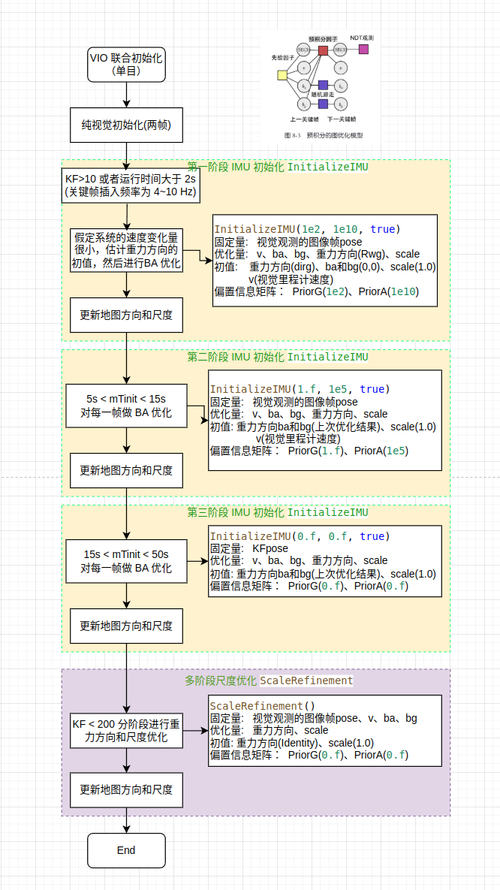
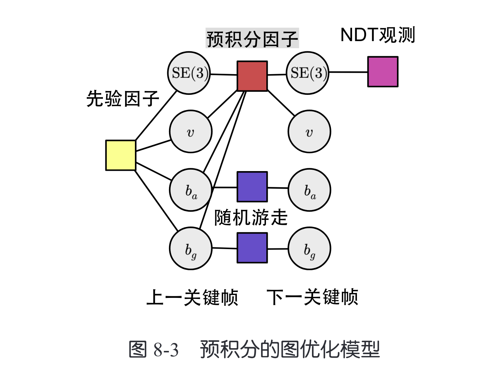

## 1 VIO 联合初始化
视觉惯性初始化是为了给惯性变量一个良好的初值，这些变量包括重力方向、零偏、尺度等。首先 IMU 的零偏是不固定的，它会受到温度、硬件老化、电磁干扰等因素的影响，并且 IMU 的零偏对测量值的影响较大，所以一般在每次系统启动时都需要进行单独的初始化。在纯视觉初始化以第一帧图像的图像坐标系为原点， 而 IMU 输出的是角速度和加速度，当前 IMU 静止时任会受到重力加速度的影响，我们在进行速度积分运算时需要减掉重力的积分值。当 IMU 静止时我们可以很容易确定重力的方向，但是 SLAM 系统往往是即时启动，我们需要运动过程中估计重力方向。通过 IMU 估计得到重力方向后我们就可以将图像坐标系的Z轴和重力方向对齐，从而避免建出的地图倾斜。

在IMU初始化阶段会进行三类优化：Visual-Only、Inertial-Only和Visual-Inertial联合



## 2 Step1 单目初始化 `MonocularInitialization`
单目初始化在 Tracking 中进行

## 3 Step2 imu 初始化 `InitializeIMU()`
imu 初始化子在单目初始化完成之后进行，会以较高的频率（4～10Hz）插入关键帧进行 IMU 的初始化，执行函数为 `InitializeIMU()` ，imu 初始化主要分为4各阶段，前三个阶段都使用`InitializeIMU` 进行图优化。
> 为什么要进行高频率的插入，是因为关键帧之间的时间间隔比较短时，IMU 之间的预积分量的不确定性也较低，在 2s 内基本可以生成是十几个关键帧和地图点。同时在短时间内(2s内)，我们可以假定系统是是静止的，方便对重力方向进行初值估计。

第一次阶段的执行 条件是(关键帧数量>10 并且距离初始关键帧的时间>1s) , `InitializeIMU` 首先计算了重力方向和视觉坐标系方向的相对旋转作为初值，需要注意的是这里假设了 1s 的系统是静止或匀速运动的，对运动方程做了简化，此时速度的增量完全由重力加速度产生，因此只需要计算速度增量与视觉坐标系的夹角 即可得重力方向矫正的旋转角(dirg)。
然后以视觉位姿作为观测，对预积分方城做图优化。 在进行图优化时我们主要需要考虑三个问题，优化量、约束(固定量)、残差、初值。 在 `InertialOptimization` 的优化问题中，优化量为重力方向，尺度，速度与偏置；固定量为视觉观测位姿，残差为预积分的 delta 量；初值，重力方向(dirg)，尺度(1.0)，速度(视觉里程计估计的速度)，ba和bg(0)。

第二和和第三界阶段使用同样调用 `InitializeIMU()` 函数执行，只是调高了（ ba、bg） 的置信度（ PriorA、PriorG），可以理解为逐步精细的求解(ba、bg)。并且第二、第三阶段会在每次加入新的关键帧时都调用 `InitializeIMU` 进行初始化，而不是向第一阶段一样只调用一次。

第四阶段为重力方向和尺度精修`ScaleRefinement`，具体做法是固定图优化中的其它顶点，只优化重力方向和尺度。这个阶段是在每次累积一定数量的关键帧后进行。



### 3.1 尺度和重力方向优化

## 4 视觉贯导联合初始化 `Optimizer::FullInertialBA`

## 5 Reference
[Site Unreachable](https://blog.csdn.net/guanjing_dream/article/details/128824320)

## 6 Appendix
```cpp
/**
 * @brief imu初始化
 * @param priorG 陀螺仪偏置的信息矩阵系数，主动设置时一般bInit为true，也就是只优化最后一帧的偏置，这个数会作为计算信息矩阵时使用
 * @param priorA 加速度计偏置的信息矩阵系数
 * @param bFIBA 是否做BA优化，目前都为true
 */
void LocalMapping::InitializeIMU(float priorG, float priorA, bool bFIBA)
{
    // 1. 将所有关键帧放入列表及向量里，且查看是否满足初始化条件
    if (mbResetRequested)
        return;

    float minTime;
    int nMinKF;
    // 从时间及帧数上限制初始化，不满足下面的不进行初始化
    if (mbMonocular)
    {
        minTime = 2.0;
        nMinKF = 10;
    }
    else
    {
        minTime = 1.0;
        nMinKF = 10;
    }

    // 当前地图大于10帧才进行初始化
    if(mpAtlas->KeyFramesInMap()<nMinKF)
        return;

    // Retrieve all keyframe in temporal order
    // 按照顺序存放目前地图里的关键帧，顺序按照前后顺序来，包括当前关键帧
    list<KeyFrame*> lpKF;
    KeyFrame* pKF = mpCurrentKeyFrame;
    while(pKF->mPrevKF)
    {
        lpKF.push_front(pKF);
        pKF = pKF->mPrevKF;
    }
    lpKF.push_front(pKF);
    // 同样内容再构建一个和lpKF一样的容器vpKF
    vector<KeyFrame*> vpKF(lpKF.begin(),lpKF.end());
    if(vpKF.size()<nMinKF)
        return;

    mFirstTs=vpKF.front()->mTimeStamp;
    if(mpCurrentKeyFrame->mTimeStamp-mFirstTs<minTime)
        return;

    // 正在做IMU的初始化，在 tracking 里面使用，如果为 true ，暂不添加关键帧
    bInitializing = true;

    // 先处理新关键帧，防止堆积且保证数据量充足
    while(CheckNewKeyFrames())
    {
        ProcessNewKeyFrame();
        vpKF.push_back(mpCurrentKeyFrame);
        lpKF.push_back(mpCurrentKeyFrame);
    }

    // 2. 正式IMU初始化
    const int N = vpKF.size();
    IMU::Bias b(0,0,0,0,0,0);

    // Compute and KF velocities mRwg estimation
    // 在IMU连一次初始化都没有做的情况下
    if (!mpCurrentKeyFrame->GetMap()->isImuInitialized())
    {
        Eigen::Matrix3f Rwg;
        Eigen::Vector3f dirG;
        dirG.setZero();

        int have_imu_num = 0;
        for(vector<KeyFrame*>::iterator itKF = vpKF.begin(); itKF!=vpKF.end(); itKF++)
        {
            if (!(*itKF)->mpImuPreintegrated)
                continue;
            if (!(*itKF)->mPrevKF)
                continue;

            have_imu_num++;
            // 初始化时关于速度的预积分定义 Ri.t()*(s*Vj - s*Vi - Rwg*g*tij)
            // 累积每一帧对重力方向的估计
            dirG -= (*itKF)->mPrevKF->GetImuRotation() * (*itKF)->mpImuPreintegrated->GetUpdatedDeltaVelocity();
            // 求取实际的速度，位移/时间
            Eigen::Vector3f _vel = ((*itKF)->GetImuPosition() - (*itKF)->mPrevKF->GetImuPosition())/(*itKF)->mpImuPreintegrated->dT;
            (*itKF)->SetVelocity(_vel);
            (*itKF)->mPrevKF->SetVelocity(_vel);
        }

        if (have_imu_num < 6)
        {
            cout << "imu初始化失败, 由于带有imu预积分信息的关键帧数量太少" << endl;
            bInitializing=false;
            mbBadImu = true;
            return;
        }

        // dirG = sV1 - sVn + n*Rwg*g*t
        // 归一化，约等于重力在世界坐标系下的方向
        dirG = dirG/dirG.norm();
        // 原本的重力方向
        Eigen::Vector3f gI(0.0f, 0.0f, -1.0f);
        // 求“重力在重力坐标系下的方向”与的“重力在世界坐标系（纯视觉）下的方向”叉乘
        Eigen::Vector3f v = gI.cross(dirG);
        // 求叉乘模长
        const float nv = v.norm();
        // 求转角大小
        const float cosg = gI.dot(dirG);
        const float ang = acos(cosg);
        // v/nv 表示垂直于两个向量的轴  ang 表示转的角度，组成角轴
        Eigen::Vector3f vzg = v*ang/nv;
        // 获得重力坐标系到世界坐标系的旋转矩阵的初值
        Rwg = Sophus::SO3f::exp(vzg).matrix();
        mRwg = Rwg.cast<double>();
        mTinit = mpCurrentKeyFrame->mTimeStamp-mFirstTs;
    }
    else
    {
        mRwg = Eigen::Matrix3d::Identity();
        mbg = mpCurrentKeyFrame->GetGyroBias().cast<double>();
        mba = mpCurrentKeyFrame->GetAccBias().cast<double>();
    }

    mScale=1.0;

    // 暂时没发现在别的地方出现过
    mInitTime = mpTracker->mLastFrame.mTimeStamp-vpKF.front()->mTimeStamp;

    std::chrono::steady_clock::time_point t0 = std::chrono::steady_clock::now();
    // 3. 计算残差及偏置差，优化尺度重力方向及速度偏置，偏置先验为0，双目时不优化尺度
    Optimizer::InertialOptimization(mpAtlas->GetCurrentMap(), mRwg, mScale, mbg, mba, mbMonocular, infoInertial, false, false, priorG, priorA);
    std::chrono::steady_clock::time_point t1 = std::chrono::steady_clock::now();

    // 尺度太小的话初始化认为失败
    if (mScale<1e-1)
    {
        cout << "scale too small" << endl;
        bInitializing=false;
        return;
    }

    // 到此时为止，前面做的东西没有改变map

    // Before this line we are not changing the map
    {
        unique_lock<mutex> lock(mpAtlas->GetCurrentMap()->mMutexMapUpdate);
        // 尺度变化超过设定值，或者非单目时（无论带不带imu，但这个函数只在带imu时才执行，所以这个可以理解为双目imu）
        if ((fabs(mScale - 1.f) > 0.00001) || !mbMonocular) {
            // 4.1 恢复重力方向与尺度信息
            Sophus::SE3f Twg(mRwg.cast<float>().transpose(), Eigen::Vector3f::Zero());
            mpAtlas->GetCurrentMap()->ApplyScaledRotation(Twg, mScale, true);
            // 4.2 更新普通帧的位姿，主要是当前帧与上一帧
            mpTracker->UpdateFrameIMU(mScale, vpKF[0]->GetImuBias(), mpCurrentKeyFrame);
        }

        // Check if initialization OK
        // 即使初始化成功后面还会执行这个函数重新初始化
        // 在之前没有初始化成功情况下（此时刚刚初始化成功）对每一帧都标记，后面的kf全部都在tracking里面标记为true
        // 也就是初始化之前的那些关键帧即使有imu信息也不算
        if (!mpAtlas->isImuInitialized())
            for (int i = 0; i < N; i++) {
                KeyFrame *pKF2 = vpKF[i];
                pKF2->bImu = true;
            }
    }

    // TODO 这步更新是否有必要做待研究，0.4版本是放在FullInertialBA下面做的
    // 这个版本FullInertialBA不直接更新位姿及三位点了
    mpTracker->UpdateFrameIMU(1.0,vpKF[0]->GetImuBias(),mpCurrentKeyFrame);

    // 设置经过初始化了
    if (!mpAtlas->isImuInitialized())
    {
        // ! 重要！标记初始化成功
        mpAtlas->SetImuInitialized();
        mpTracker->t0IMU = mpTracker->mCurrentFrame.mTimeStamp;
        mpCurrentKeyFrame->bImu = true;
    }

    std::chrono::steady_clock::time_point t4 = std::chrono::steady_clock::now();
    // 代码里都为true
    if (bFIBA)
    {
        // 5. 承接上一步纯imu优化，按照之前的结果更新了尺度信息及适应重力方向，所以要结合地图进行一次视觉加imu的全局优化，这次带了MP等信息
        // ! 1.0版本里面不直接赋值了，而是将所有优化后的信息保存到变量里面
        if (priorA!=0.f)
            Optimizer::FullInertialBA(mpAtlas->GetCurrentMap(), 100, false, mpCurrentKeyFrame->mnId, NULL, true, priorG, priorA);
        else
            Optimizer::FullInertialBA(mpAtlas->GetCurrentMap(), 100, false, mpCurrentKeyFrame->mnId, NULL, false);
    }

    std::chrono::steady_clock::time_point t5 = std::chrono::steady_clock::now();

    Verbose::PrintMess("Global Bundle Adjustment finished\nUpdating map ...", Verbose::VERBOSITY_NORMAL);

    // Get Map Mutex
    unique_lock<mutex> lock(mpAtlas->GetCurrentMap()->mMutexMapUpdate);

    unsigned long GBAid = mpCurrentKeyFrame->mnId;

    // Process keyframes in the queue
    // 6. 处理一下新来的关键帧，这些关键帧没有参与优化，但是这部分bInitializing为true，只在第2次跟第3次初始化会有新的关键帧进来
    // 这部分关键帧也需要被更新
    while(CheckNewKeyFrames())
    {
        ProcessNewKeyFrame();
        vpKF.push_back(mpCurrentKeyFrame);
        lpKF.push_back(mpCurrentKeyFrame);
    }

    // Correct keyframes starting at map first keyframe
    // 7. 更新位姿与三维点
    // 获取地图中初始关键帧，第一帧肯定经过修正的
    list<KeyFrame*> lpKFtoCheck(mpAtlas->GetCurrentMap()->mvpKeyFrameOrigins.begin(),mpAtlas->GetCurrentMap()->mvpKeyFrameOrigins.end());

    // 初始就一个关键帧，顺藤摸瓜找到父子相连的所有关键帧
    // 类似于树的广度优先搜索，其实也就是根据父子关系遍历所有的关键帧，有的参与了FullInertialBA有的没参与
    while(!lpKFtoCheck.empty())
    {
        // 7.1 获得这个关键帧的子关键帧
        KeyFrame* pKF = lpKFtoCheck.front();
        const set<KeyFrame*> sChilds = pKF->GetChilds();
        Sophus::SE3f Twc = pKF->GetPoseInverse();  // 获得关键帧的优化前的位姿
        // 7.2 遍历这个关键帧所有的子关键帧
        for(set<KeyFrame*>::const_iterator sit=sChilds.begin();sit!=sChilds.end();sit++)
        {
            // 确认是否能用
            KeyFrame* pChild = *sit;
            if(!pChild || pChild->isBad())
                continue;

            // 这个判定为true表示pChild没有参与前面的优化，因此要根据已经优化过的更新，结果全部暂存至变量
            if(pChild->mnBAGlobalForKF!=GBAid)
            {
                // pChild->GetPose()也是优化前的位姿，Twc也是优化前的位姿
                // 7.3 因此他们的相对位姿是比较准的，可以用于更新pChild的位姿
                Sophus::SE3f Tchildc = pChild->GetPose() * Twc;
                // 使用相对位姿，根据pKF优化后的位姿更新pChild位姿，最后结果都暂时放于mTcwGBA
                pChild->mTcwGBA = Tchildc * pKF->mTcwGBA;

                // 7.4 使用相同手段更新速度
                Sophus::SO3f Rcor = pChild->mTcwGBA.so3().inverse() * pChild->GetPose().so3();
                if(pChild->isVelocitySet()){
                    pChild->mVwbGBA = Rcor * pChild->GetVelocity();
                }
                else {
                    Verbose::PrintMess("Child velocity empty!! ", Verbose::VERBOSITY_NORMAL);
                }

                pChild->mBiasGBA = pChild->GetImuBias();
                pChild->mnBAGlobalForKF = GBAid;

            }
            // 加入到list中，再去寻找pChild的子关键帧
            lpKFtoCheck.push_back(pChild);
        }

        // 7.5 此时pKF的利用价值就没了，但是里面的数值还都是优化前的，优化后的全部放于类似mTcwGBA这样的变量中
        // 所以要更新到正式的状态里，另外mTcwBefGBA要记录更新前的位姿，用于同样的手段更新三维点用
        pKF->mTcwBefGBA = pKF->GetPose();
        pKF->SetPose(pKF->mTcwGBA);

        // 速度偏置同样更新
        if(pKF->bImu)
        {
            pKF->mVwbBefGBA = pKF->GetVelocity();
            pKF->SetVelocity(pKF->mVwbGBA);
            pKF->SetNewBias(pKF->mBiasGBA);
        } else {
            cout << "KF " << pKF->mnId << " not set to inertial!! \n";
        }

        // pop
        lpKFtoCheck.pop_front();
    }

    // Correct MapPoints
    // 8. 更新三维点，三维点在优化后同样没有正式的更新，而是找了个中间变量保存了优化后的数值
    const vector<MapPoint*> vpMPs = mpAtlas->GetCurrentMap()->GetAllMapPoints();

    for(size_t i=0; i<vpMPs.size(); i++)
    {
        MapPoint* pMP = vpMPs[i];

        if(pMP->isBad())
            continue;

        // 8.1 如果这个点参与了全局优化，那么直接使用优化后的值来赋值
        if(pMP->mnBAGlobalForKF==GBAid)
        {
            // If optimized by Global BA, just update
            pMP->SetWorldPos(pMP->mPosGBA);
        }
        // 如果没有参与，与关键帧的更新方式类似
        else
        {
            // Update according to the correction of its reference keyframe
            KeyFrame* pRefKF = pMP->GetReferenceKeyFrame();

            if(pRefKF->mnBAGlobalForKF!=GBAid)
                continue;

            // Map to non-corrected camera
            // 8.2 根据优化前的世界坐标系下三维点的坐标以及优化前的关键帧位姿计算这个点在关键帧下的坐标
            Eigen::Vector3f Xc = pRefKF->mTcwBefGBA * pMP->GetWorldPos();

            // Backproject using corrected camera
            // 8.3 根据优化后的位姿转到世界坐标系下作为这个点优化后的三维坐标
            pMP->SetWorldPos(pRefKF->GetPoseInverse() * Xc);
        }
    }

    Verbose::PrintMess("Map updated!", Verbose::VERBOSITY_NORMAL);

    mnKFs=vpKF.size();
    mIdxInit++;

    // 9. 再有新的来就不要了~不然陷入无限套娃了
    for(list<KeyFrame*>::iterator lit = mlNewKeyFrames.begin(), lend=mlNewKeyFrames.end(); lit!=lend; lit++)
    {
        (*lit)->SetBadFlag();
        delete *lit;
    }
    mlNewKeyFrames.clear();

    mpTracker->mState=Tracking::OK;
    bInitializing = false;

    mpCurrentKeyFrame->GetMap()->IncreaseChangeIndex();

    return;
}
```