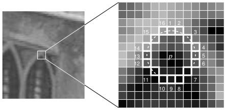
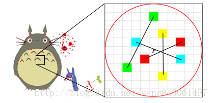
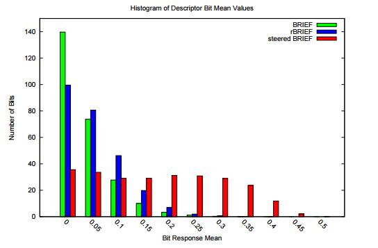
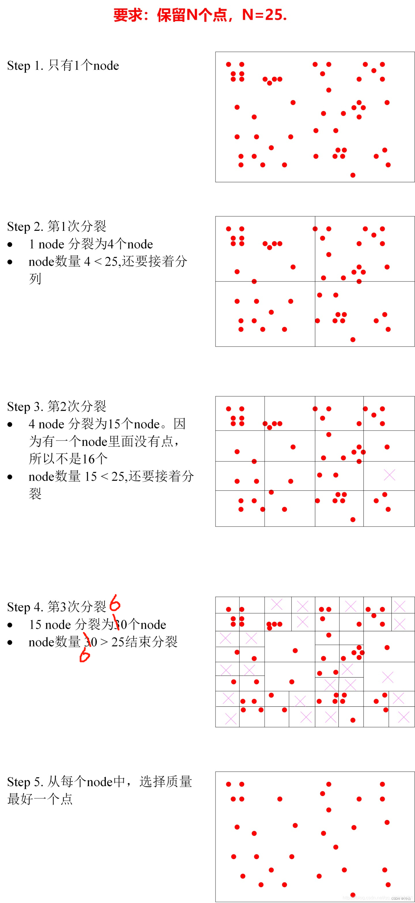

一个好的特征描述符应该至少保留以下特征：
1. 旋转不变性
2. 尺度不变性 
3. 光度不敏感
## 1 ORB 特征提取 124456789
ORB - (Oriented Fast and Rotated BRIEF)算法是基于FAST特征检测与BRIEF特征描述子匹配实现，相比BRIEF算法中依靠随机方式获取而值点对，ORB通过FAST方法，FAST方式寻找候选特征点方式是假设灰度图像像素点A周围的像素存在连续大于或者小于A的灰度值。
### 1.1 Fast 角点
 FAST角点定义为：若某像素点与周围邻域足够多的像素点处于不同区域，则该像素可能为角点。考虑灰度图像，即若某像素点的灰度值比周围邻域足够多的像素点的灰度值大或小，则该点可能为角点。
- 对于图像中一个像素点$p$，其灰度值为$I_p$
- 以该像素点为中心考虑一个半径为3的离散化的Bresenham圆，圆边界上有16个像素(如下图所示)
- 设定一个合适的阈值$t$，如果圆上有n个连续像素点的灰度值小于$I_p−t$或者大于$I_p+t$，那么这个点即可判断为角点(n的值可取12或9)
 
一种快速排除大部分非角点像素的方法就是检查周围1、5、9、13四个位置的像素，如果位置1和9与中心像素P点的灰度差小于给定阈值，则P点不可能是角点，直接排除；否则进一步判断位置5和13与中心像素的灰度差，如果四个像素中至少有3个像素与P点的灰度差超过阈值，则考察邻域圆上16个像素点与中心点的灰度差，如果有至少9个超过给定阈值则认为是角点。

Fast 检测出角点很多都是相邻的，Fast 对其做了非极大值一致处理，对于每个 Fast 交点使用其周围 16 个像素与中心点像素差值的绝对值之和作为得分，对于相邻的像素选择得分最大的点。

### 1.2 brief 特征描述符
brief 特征描述的原理是在关键点周围随机选取 N 个点对，对比像素点的像素值大小，根据其像素值的大小得到(0，1)编码，这种二进制编码的表示，可以进行快速的特征匹配和相似度计算。

### 1.3 旋转不变性
brief  本身不具有灰度不变性 ，为了保证旋转不变性，ORB 通过关键点邻域内的[灰度质心](https://zhuanlan.zhihu.com/p/481373935)作为特征点的主方向。计算特征描述符时先将主方向旋转为一致，再计算 brief 特征描述符，从而保证旋转不变性。但是旋转后的特征描述符虽然具有了旋转不变性，但是可区分度变弱了。如下图所示，为几种特征描述子的均值分布，横轴为均值与0.5之间的距离，纵轴为相应均值下特征点的统计数量。可以看出，BRIEF描述子所有比特位的均值接近于0.5，且方差很大；方差越大表明可区分性越好。不同特征点的描述子表现出较大的差异性，不易造成无匹配。但steered BRIEF进行了坐标旋转，损失了这个特性，导致可区分性减弱，相关性变强，不利于匹配。为了解决这个问题， ORB 使用了一种基于学习的方法来选择一定数量的随机点对，详情见 [图像特征描述子之ORB | Senit\_Co](https://senitco.github.io/2017/07/09/image-feature-orb/)。

### 1.4 特征均匀化
在根据特征点进行位姿求解时，我们希望特征点是比较分散的而不是集中在小块的区域。因为这样可以产生更强的和约束，使得位姿求解更精确。ORB 在进行特征提取时使用了两个 tips 来均匀化特征点。1. 根据图像金字塔的分辨率比例分配每层图像需要提取的特征点数量。2. 使四叉树分裂的方式均匀化特征点，具体方法是对提取所有特征点后对图像进行四叉树分块，如果块中的特征点数量大于1个则进行继续分裂或选取响应值(Fast 交点的得分)最大的特征点，是否分裂取决于是否达到了期望的特征点数量。

### 1.5 Reference:
[图像特征之FAST角点检测 | Senit\_Co](https://senitco.github.io/2017/06/30/image-feature-fast/)
[图像特征描述子之ORB | Senit\_Co](https://senitco.github.io/2017/07/09/image-feature-orb/)
[Site Unreachable](https://zhuanlan.zhihu.com/p/481373935)
## 2 SIFT

